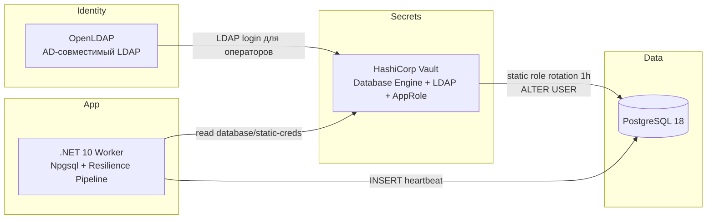

# PostgresVaultService

Демонстрационный стек: **.NET 10 + Npgsql + PostgreSQL 18 + HashiCorp Vault + OpenLDAP (AD/LDAP)** с автоматической почасовой ротацией пароля технологической учётной записи средствами **Vault Database Secrets Engine** и бесшовным переподключением сервиса.

## Архитектура



### Компоненты

| Сервис | Назначение |
|--------|------------|
| `ldap` | AD-совместимый LDAP-каталог для аутентификации операторов в Vault |
| `postgres` | PostgreSQL 18, БД `appdb`, технический пользователь `app_tech` |
| `vault` | Database Secrets Engine, static role `app-tech`, LDAP auth, AppRole |
| `vault-init` | Одноразовая инициализация Vault: database engine, static role, LDAP, AppRole |
| `app` | .NET Worker: читает credentials из Vault, выполняет регулярные INSERT |

> **Примечание:** вместо FreeIPA используется OpenLDAP — тот же протокол LDAP, который Vault использует для AD-интеграции. FreeIPA требует privileged/systemd и часто не стартует в ограниченных Docker-средах.

### Ротация и бесшовное переподключение

1. **Vault Database Secrets Engine** (static role `app-tech`, `rotation_period=1h`):
   - генерирует новый пароль;
   - выполняет `ALTER USER app_tech WITH PASSWORD ...` в PostgreSQL;
   - сохраняет пароль внутри Vault (атомарный цикл, без внешнего ротатора).

2. **.NET сервис**:
   - читает `database/static-creds/app-tech` каждые 15 секунд;
   - при изменении пароля создаёт новый `NpgsqlDataSource`;
   - старый пул соединений выводится из эксплуатации с задержкой 60 секунд;
   - при ошибке аутентификации (`28P01`/`28000`) принудительно обновляет credentials и повторяет подключение;
   - **Resilience Pipeline** (Polly): retry + timeout для операций Vault и PostgreSQL.

## Быстрый старт

### Требования

- Docker 24+ и Docker Compose v2
- macOS, Linux или Windows (Docker Desktop) — стек использует bridge-сеть Docker
- Порты на хосте: `389`, `5432`, `8200`

### Запуск

```bash
cp .env.example .env
docker compose up --build -d
```

Проверка статуса:

```bash
docker compose ps
docker compose logs vault-init
docker compose logs -f app
```

Ожидаемый результат `docker compose ps`:
- `ldap`, `postgres`, `vault`, `app` — **Up**
- `vault-init` — **Exited (0)**

### Проверка вставок в PostgreSQL

```bash
docker compose exec postgres psql -U postgres -d appdb -h 127.0.0.1 -c \
  "SELECT id, event_type, created_at FROM app_events ORDER BY id DESC LIMIT 10;"
```

### Проверка ротации

```bash
# Принудительная ротация через Vault
docker compose exec vault vault write -f database/rotate-role/app-tech

# Текущие credentials
docker compose exec vault vault read database/static-creds/app-tech

# Логи сервиса — должен появиться "PostgreSQL credentials refreshed"
docker compose logs --tail=50 app
```

## Интеграция с LDAP (AD)

Vault настроен на LDAP-аутентификацию через OpenLDAP:

- **URL:** `ldap://localhost:389`
- **Домен:** `demo.local`
- **Администратор:** `admin` / пароль из `FREEIPA_ADMIN_PASSWORD`

Вход оператора в Vault через LDAP:

```bash
export VAULT_ADDR=http://localhost:8200
docker compose exec vault vault login -method=ldap username=admin
# пароль: значение FREEIPA_ADMIN_PASSWORD (по умолчанию Secret123!)
```

Группы `admins` и `ipausers` получают политику `ldap-users` (чтение `database/static-creds/app-tech`).

Сервис приложения использует **AppRole** (машинная аутентификация).

## Локальная разработка (.NET)

```bash
export PATH="$HOME/.dotnet:$PATH"
dotnet restore PostgresVaultService.sln
dotnet build PostgresVaultService.sln
dotnet run --project src/PostgresVaultService
```

Переменные окружения для локального запуска (после `docker compose up`):

```bash
export Vault__Address=http://localhost:8200
export Vault__StaticRoleName=app-tech
export Vault__RoleId=$(docker compose exec vault cat /vault/init/app-role-id)
export Vault__SecretId=$(docker compose exec vault cat /vault/init/app-secret-id)
export Postgres__Host=localhost
```

## Структура проекта

```
├── docker-compose.yml
├── .env.example
├── docker/
│   ├── postgres/init/01-init.sql
│   ├── openldap/bootstrap/
│   └── vault/                  # config, policies, init Dockerfile
├── scripts/vault-init.sh
└── src/PostgresVaultService/   # .NET 10 Worker
    ├── Resilience/             # Resilience Pipeline (Polly)
    ├── Services/
    └── ...
```

## Настройка

| Переменная | По умолчанию | Описание |
|------------|--------------|----------|
| `POSTGRES_ADMIN_PASSWORD` | `postgres-admin-secret` | Пароль суперпользователя PostgreSQL (для Vault database config) |
| `FREEIPA_ADMIN_PASSWORD` | `Secret123!` | Пароль admin LDAP |
| `ROTATION_PERIOD` | `1h` | Период ротации static role в Vault |
| `Vault__PollIntervalSeconds` | `15` | Интервал опроса Vault (сек) |
| `Postgres__InsertIntervalSeconds` | `5` | Интервал INSERT (сек) |
| `Resilience__VaultMaxRetryAttempts` | `3` | Retry при сбоях Vault |
| `Resilience__PostgresMaxRetryAttempts` | `3` | Retry при transient-ошибках PostgreSQL |

## Устранение неполадок

| Проблема | Решение |
|----------|---------|
| `vault` не стартует (`address already in use` на 8200) | Используется `entrypoint: ["vault"]` — образ HashiCorp по умолчанию добавляет dev-режим поверх config |
| `postgres` падает на PostgreSQL 18 | Volume смонтирован в `/var/lib/postgresql` (требование PG 18+) |
| Контейнеры не видят друг друга | Проверьте, что все сервисы в сети `demo-net` (`docker network inspect vault-secret-rotation-demo_demo-net`) |
| `vault-init` ждёт Vault | Healthcheck и curl используют `?sealedcode=200&uninitcode=200` |

## Остановка и очистка

```bash
docker compose down
# Полная очистка данных:
docker compose down -v
```

## Безопасность (production)

Это демонстрационный стек. Для production рекомендуется:

- включить TLS для Vault, PostgreSQL и LDAP;
- использовать Vault HA + auto-unseal (KMS/HSM);
- заменить file storage Vault на integrated storage (Raft) в HA-режиме;
- использовать bridge-сеть Docker (по умолчанию в этом стеке) или dedicated overlay-сеть в оркестраторе;
- заменить OpenLDAP на FreeIPA/Active Directory при наличии инфраструктуры;
- ограничить AppRole политиками least-privilege;
- настроить аудит Vault и PostgreSQL.
