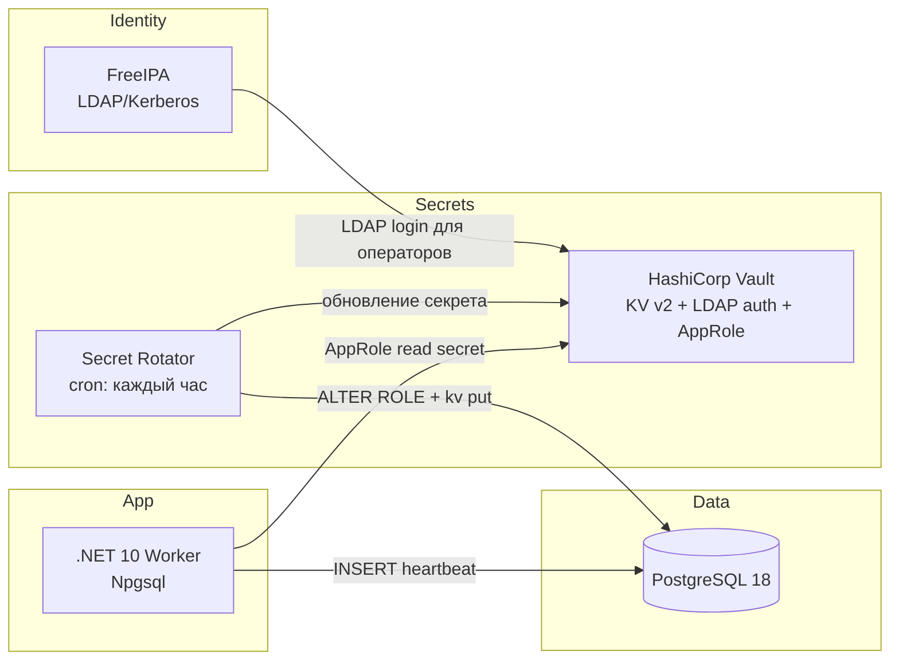

# PostgresVaultService

Демонстрационный стек: **.NET 10 + Npgsql + PostgreSQL 18 + HashiCorp Vault + FreeIPA (AD/LDAP)** с автоматической почасовой ротацией пароля технологической учётной записи и бесшовным переподключением сервиса.

## Архитектура



### Компоненты

| Сервис | Назначение |
|--------|------------|
| `freeipa` | AD-совместимый каталог (LDAP/Kerberos) для аутентификации операторов в Vault |
| `postgres` | PostgreSQL 18, БД `appdb`, технический пользователь `app_tech` |
| `vault` | Хранение секрета `secret/postgresql/app_tech` |
| `vault-init` | Одноразовая инициализация Vault: KV, LDAP, AppRole, политики |
| `rotator` | Почасовая ротация пароля `app_tech` в PostgreSQL и Vault |
| `app` | .NET Worker: читает секрет из Vault, выполняет регулярные INSERT |

### Ротация и бесшовное переподключение

1. **Rotator** (каждый час и при старте):
   - генерирует новый пароль;
   - выполняет `ALTER ROLE app_tech WITH PASSWORD ...` в PostgreSQL;
   - записывает секрет в Vault (`secret/postgresql/app_tech`).

2. **.NET сервис**:
   - опрашивает Vault каждые 15 секунд (настраивается);
   - при изменении пароля создаёт новый `NpgsqlDataSource`;
   - старый пул соединений выводится из эксплуатации с задержкой 60 секунд;
   - при ошибке аутентификации (`28P01`/`28000`) принудительно обновляет секрет и повторяет подключение.

## Быстрый старт

### Требования

- Docker 24+ и Docker Compose v2
- ≥ 4 GB RAM (FreeIPA требует ресурсов, первый запуск может занять 5–10 минут)
- Порты: `5432`, `8200`, `8389`, `8080`, `8443`

### Запуск

```bash
cp .env.example .env
docker compose up --build -d
```

Проверка статуса:

```bash
docker compose ps
docker compose logs -f app
docker compose logs -f rotator
```

### Проверка вставок в PostgreSQL

```bash
docker compose exec postgres psql -U postgres -d appdb -c \
  "SELECT id, event_type, created_at FROM app_events ORDER BY id DESC LIMIT 10;"
```

### Проверка ротации

```bash
# Принудительная ротация
docker compose exec rotator /usr/local/bin/rotate-password.sh

# Логи сервиса — должен появиться "PostgreSQL credentials refreshed"
docker compose logs --tail=50 app
```

## Интеграция с FreeIPA (AD)

Vault настроен на LDAP-аутентификацию через FreeIPA:

- **URL:** `ldap://freeipa:389`
- **Домен:** `demo.local`
- **Администратор:** `admin` / пароль из `FREEIPA_ADMIN_PASSWORD`

Вход оператора в Vault через LDAP:

```bash
export VAULT_ADDR=http://localhost:8200
docker compose exec vault vault login -method=ldap username=admin
# пароль: значение FREEIPA_ADMIN_PASSWORD (по умолчанию Secret123!)
```

Группы FreeIPA `admins` и `ipausers` получают политику `ldap-users` (чтение секретов PostgreSQL).

Сервис приложения использует **AppRole** (машинная аутентификация) — это стандартная практика для автоматизированных workload.

## Локальная разработка (.NET)

```bash
export PATH="$HOME/.dotnet:$PATH"
dotnet restore PostgresVaultService.sln
dotnet build PostgresVaultService.sln
dotnet run --project src/PostgresVaultService
```

Переменные окружения для локального запуска (после `docker compose up`):

```bash
export Vault__Address=http://localhost:8200
export Vault__RoleId=$(docker compose exec vault cat /vault/init/app-role-id)
export Vault__SecretId=$(docker compose exec vault cat /vault/init/app-secret-id)
```

## Структура проекта

```
├── docker-compose.yml
├── .env.example
├── docker/
│   ├── postgres/init/01-init.sql
│   ├── vault/                  # config, policies, init Dockerfile
│   └── rotator/                # скрипт почасовой ротации
├── scripts/vault-init.sh
└── src/PostgresVaultService/   # .NET 10 Worker
    ├── Services/
    │   ├── VaultSecretProvider.cs
    │   ├── DynamicPostgresConnectionFactory.cs
    │   └── InsertWorker.cs
    └── ...
```

## Настройка

| Переменная | По умолчанию | Описание |
|------------|--------------|----------|
| `POSTGRES_ADMIN_PASSWORD` | `postgres-admin-secret` | Пароль суперпользователя PostgreSQL |
| `FREEIPA_ADMIN_PASSWORD` | `Secret123!` | Пароль admin FreeIPA |
| `Vault__PollIntervalSeconds` | `15` | Интервал опроса Vault (сек) |
| `Postgres__InsertIntervalSeconds` | `5` | Интервал INSERT (сек) |

Расписание ротации задаётся в `docker/rotator/entrypoint.sh` (`0 * * * *` — каждый час).

## Остановка и очистка

```bash
docker compose down
# Полная очистка данных:
docker compose down -v
```

## Безопасность (production)

Это демонстрационный стек. Для production рекомендуется:

- включить TLS для Vault, PostgreSQL и LDAP;
- использовать Vault HA + auto-unseal (KMS/HSM);
- заменить file storage Vault на Consul/Raft HA;
- ограничить AppRole политиками least-privilege;
- настроить аудит Vault и PostgreSQL;
- использовать Vault Database Secrets Engine вместо shell-ротатора (опционально).
